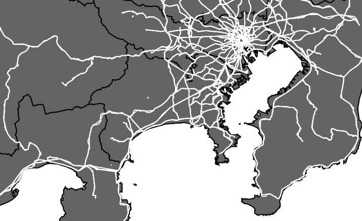
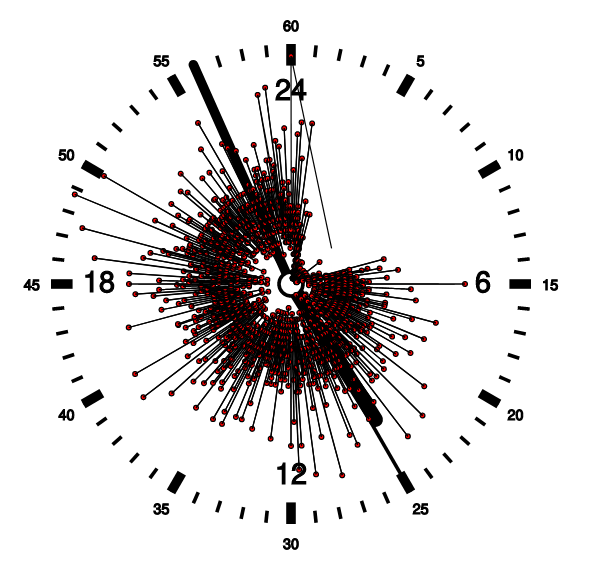
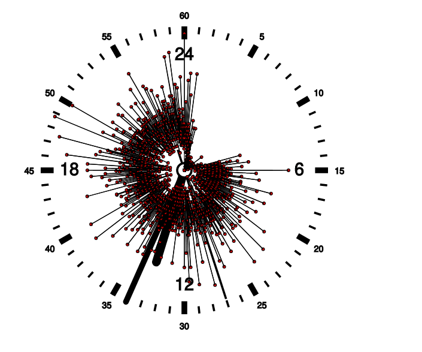
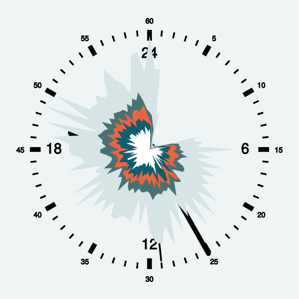

# 中村の進捗

# 11/7日分
- テーマが決まりきっていないのでテーマ決めから
前回出した案
- YouTubeの好きなチャンネルの情報を可視化 再生数＋タグ
- 去年の鉄道マップの全国版（ヤフー乗り換えとかぶらないようにしないといけない）
- 飛行機事故の可視化
- 鉄道人身事故のデータベースの視覚化

今日出した案
- 統計局の世界のデータベース的なのを紹介してそれをあさってみている


**一旦鉄道人身事故データベースの可視化でやる**

## 可視化する内容
- 日本地図と路線図
    - 去年の路線図のデータみたくどこかにデータが落ちているはず
- 日時情報
    - https://jinshinjiko.com/
    - ↑をひたすらスクレイピング
- 人身事故による影響の大きさ（Tweet数から算出）
    - 事故発生時 - 2時間後までの関連する路線名で検索したときのTweet数で出す
    - Twitter API申請済み
- ホームドアの設置状況（WebArchiveから出す）
    - https://www.mlit.go.jp/tetudo/tetudo_tk6_000022.html
    - web archiveに過去7年くらいのデータがある

TOP Page


## どうやって情報を蓄積するかの案
- 基本CSVでよさそう（RDB使いたいなら後から使えばいい）
- 人身事故のデータは基本URL/IDになっているので簡単にスクレイピング出来る
    - curlで取得出来たのでseleniumもいらなさそう
    - https://jinshinjiko.com/accidents/14847
- 一覧については[https://jinshinjiko.com/accidents?limit=10&offset=0](https://jinshinjiko.com/accidents?limit=10&offset=0)のlimitを14898にすることで全件が一気に取得できた

- サクッと[csv](data/jinshin.csv)作成
    -  作成元は[このプログラム](nakamura/dataextract.ipynb)
    -  各事故の詳細は追ってスクレイピングするで良さそう
    -  駅間をどうするか、会社の表記ゆれをどう対応するか

# 11/8
[csv](data/jinshin_archive_sentence.csv)に
- 事故の文面（サイトに掲載のもの）
- ニュースサイトの魚拓URL（サイトからリンクであれば）
を追加するために追加でスクレイピングした。

路線図データを入手するべくgeojsonの入手先を発見

https://uedayou.net/jrslod-geojson-downloader/

ダウンロード自動化をしようと思ったが、複雑そうなので一旦断念してJR東日本までダウンロードしたところで加賀谷くんに頼む。

d3.jsで路線図のデータを描画するようにした。基本はjapan.htmlを参考にした。
.png)

全路線図のデータを描画することに成功した。駅のポイントの点も任意の形に変えられるようになった。


# 11/10
geojsonの構造を見ると、以下のようになっている。
propertiesには好きな情報を入れて良い。geometryのtypeで点なのか線なのか判別可能。
ホームドア設置状況はpoitn側のpropertiesの中に`"door": "2016-04-01"`のようにして追加できれば追加でcsvを読み込まなくても良いのでこれを行う。
```json
        {
            "properties": {
                "name": "盛岡",
                "uri": "https://uedayou.net/jrslod/IGRいわて銀河鉄道/いわて銀河鉄道線/盛岡",
                "color": "0000CD"
            },
            "type": "Feature",
            "geometry": {
                "type": "LineString",
                "coordinates": [
                    [
                        141.13802,
                        39.69969
                    ],
                    [
                        141.13473,
                        39.7027
                    ]
                ]
            }
        },
        {
            "properties": {
                "name": "盛岡",
                "uri": "https://uedayou.net/jrslod/IGRいわて銀河鉄道/いわて銀河鉄道線/盛岡"
            },
            "type": "Feature",
            "geometry": {
                "type": "Point",
                "coordinates": [
                    141.13473,
                    39.7027
                ]
            }
        },
```
次に人身事故のデータと、駅データの結びつけ方を考える必要がある。

- QAR
    - 時系列シークバー
        - 加賀谷くん
    - ズームインアウト、移動
        - ちょざい
    - 時計
        - 自分
    - 時系列グラフ
        - 簡単なのでパス

- 作業
    - geojsonのpropertiesに路線とホームドア設置日時を追加
        - 路線はちょざい？
        - ホームドアは一旦既存データの日時の変換を加賀谷くんがやる
    - 駅間で起きた人身事故の対処法を考える
        - 自分で考える

時計の進捗[はここ](nakamura/clock.html)
- まず時計を描画した（webからsampleを引っ張ってきて、バージョンの差異を修正した）
- 次に時計の針とかをぐるぐる回せるようにした
- 任意のデータ（時刻と値のペア）を、時計上に表示できるようにした
- 実際の人身事故データのうち、時刻のみを取り出して、時刻別に件数を計算してjsonに保存する[スクリプトをPythonで書いてjsonを保存](nakamura/dataextract.ipynb)
    - jsonは[ここ](nakamura/timeonly.json)
- d3.jsでjsonを読み込んで、実際のデータで描画出来るようにした。

18:36注：
なんかバグってたので、2点を割り出すアルゴリズムと、元のデータを変更（事故の起こっていない時刻を0埋め）して、修正した。


見づらいので、15分か30分おきに4文意数を取って描画するほうがよさそう。
0, 25, 25, 75, 100%点をjsonに保存して（例によってnotebookでpythonで行った）、描画するようにした。



TODO:曜日ごとに変更出来るようにする。
- 曜日ごとのjsonを用意するところから必要

※前回の進捗で忘れてた分
- [このjsファイル](nakamura/datalist.js)は、[このスクリプト](nakamura/find_geojson.py)でgeojsonを再帰的に探索し、そのパスをjsファイルとして保存するもので、これによって一括でデータを管理することが出来るようになった。

